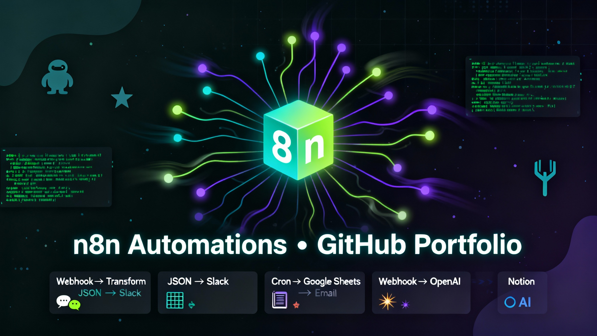

### my_n8n_projects

#### About

This repository hosts my collection of n8n workflows and supporting assets. I use it to share automations I build for personal projects, prototypes, and reusable components. I update the repo regularly as I refine existing flows and add new ones.

- GitHub profile: https://github.com/arad1367
- Contact: pejman.ebrahimi@gmail.com

#### What’s inside

- Ready-to-import n8n JSON workflow files
- Reusable sub-workflows and utility nodes
- Examples that integrate common tools and services
- Notes, environment variable tips, and runbooks

#### Example workflows

- Webhook → Transform JSON → Post to Chat
- Cron → Google Sheets → Email summary
- Webhook → OpenAI → Notion page creation
- RSS → Filter → Telegram broadcast

#### Getting started

1. Install n8n (Docker or desktop).
2. Import a workflow JSON from this repo into your n8n instance.
3. Configure required credentials and environment variables.
4. Run and iterate.

Helpful docs:
- n8n docs: https://docs.n8n.io
- Credentials guide: https://docs.n8n.io/credentials/
- Workflows import/export: https://docs.n8n.io/workflows/export-import/

#### Folder structure

- workflows/ — main n8n workflow JSON files
- subworkflows/ — smaller reusable flows (Execute Workflow)
- templates/ — starter patterns and blueprints
- docs/ — notes, setup guides, and references
- assets/ — images, diagrams (e.g., n8n.png)

#### Contributing

Issues and pull requests are welcome. If you have suggestions for improvements, new workflow ideas, or bug fixes, feel free to open an issue or PR.

Please include:
- A short description of the change
- Any new environment variables or credentials required
- A minimal test or run note

#### Roadmap

- Add more templates for common SaaS integrations
- Expand error-handling and retry patterns
- Include CI checks for workflow JSON validation
- Publish example credentials setup (redacted)

#### License

Unless otherwise noted within a file or folder, content in this repository is shared under the MIT License. See LICENSE for details.

—

If you use or adapt these workflows, a star on the repo is appreciated!
